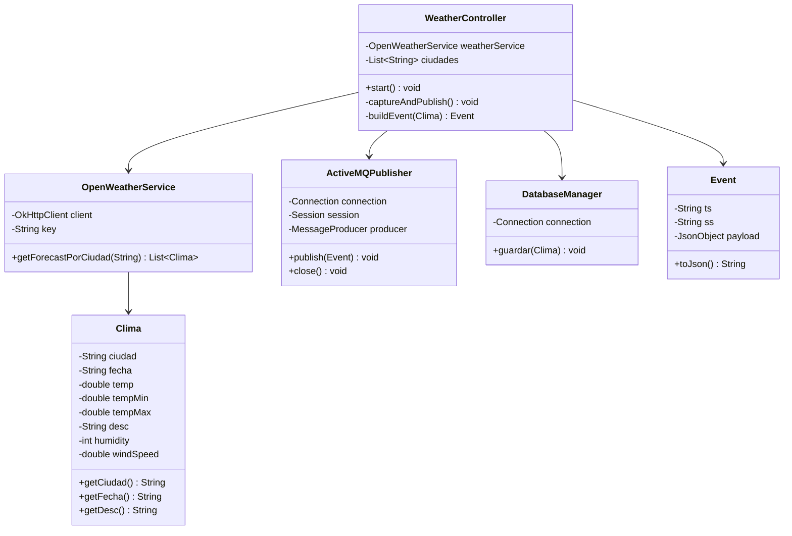
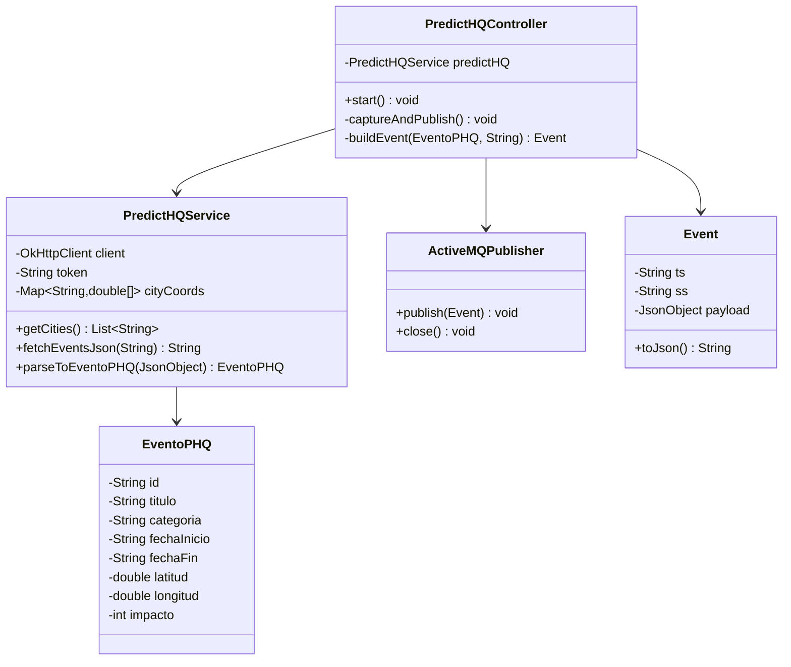
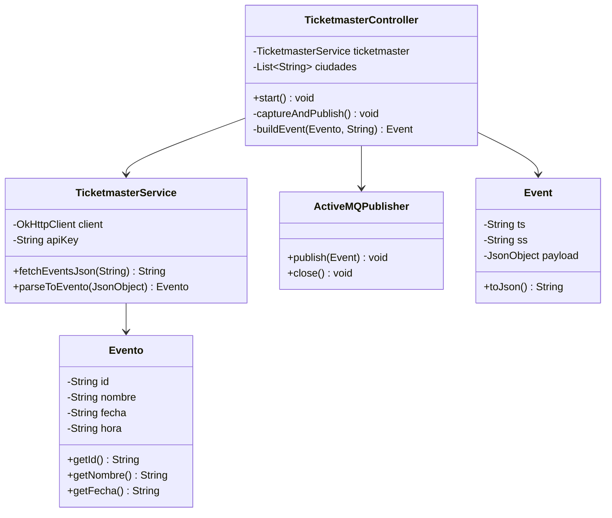
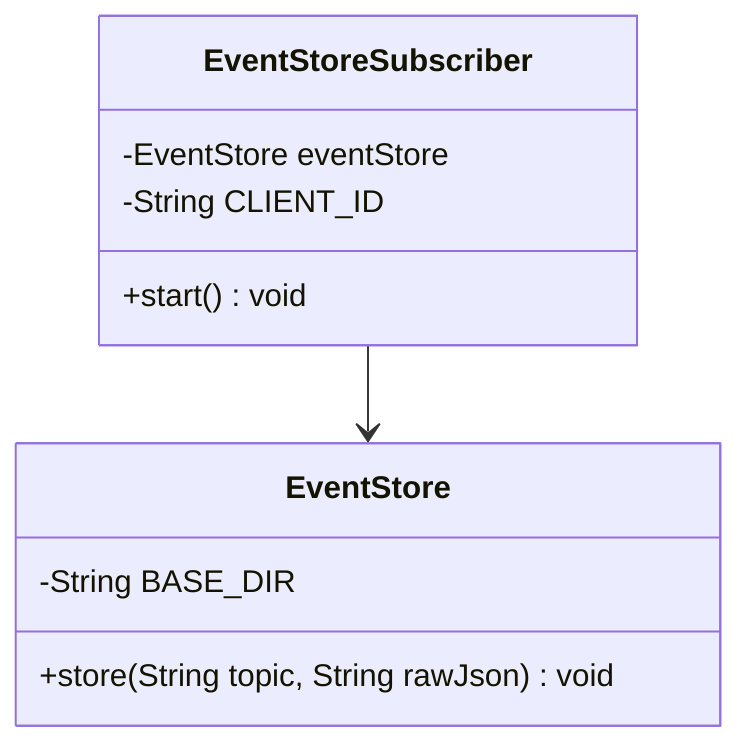
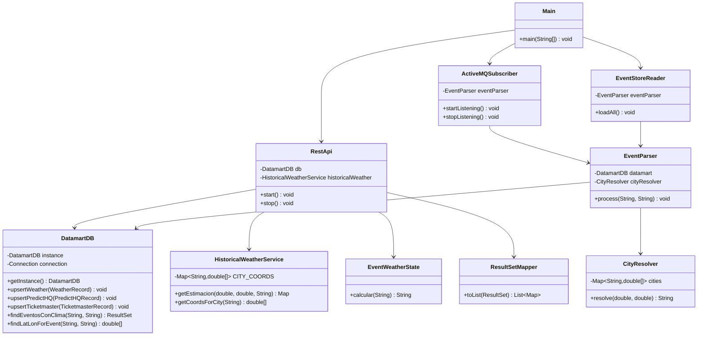

# EventWeather Spain

Sistema distribuido basado en eventos para la captura, almacenamiento y consulta de **datos meteorológicos y de eventos culturales/deportivos** en ciudades de España. Integra tres APIs externas (OpenWeather, PredictHQ y Ticketmaster) mediante un broker de mensajería ActiveMQ y expone los datos unificados a través de una API REST.

---

## Tabla de Contenidos

- [Descripción General](#descripción-general)
- [Justificación de APIs y Estructura del Datamart](#justificación-de-apis-y-estructura-del-datamart)
- [Arquitectura](#arquitectura)
  - [Diagrama de Componentes](#diagrama-de-componentes)
  - [Arquitectura de la Aplicación](#arquitectura-de-la-aplicación)
  - [Flujo de Datos](#flujo-de-datos)
- [Módulos](#módulos)
  - [openweather-module](#openweather-module)
  - [predicthq-module](#predicthq-module)
  - [ticketmaster-module](#ticketmaster-module)
  - [event-store-builder](#event-store-builder)
  - [business-unit](#business-unit)
- [Tecnologías Utilizadas](#tecnologías-utilizadas)
- [Principios y Patrones de Diseño](#principios-y-patrones-de-diseño)
- [Requisitos Previos](#requisitos-previos)
- [Instalación y Configuración](#instalación-y-configuración)
  - [1. Clonar el Repositorio](#1-clonar-el-repositorio)
  - [2. Instalar Apache ActiveMQ](#2-instalar-apache-activemq)
  - [3. Obtener API Keys](#3-obtener-api-keys)
  - [4. Configurar cada Módulo](#4-configurar-cada-módulo)
  - [5. Compilar el Proyecto](#5-compilar-el-proyecto)
- [Ejecución](#ejecución)
  - [Orden de Arranque](#orden-de-arranque)
  - [Ejecutar cada Módulo](#ejecutar-cada-módulo)
- [API REST — Endpoints](#api-rest--endpoints)
- [Modelo de Datos](#modelo-de-datos)
  - [Tabla Unificada (OBT)](#tabla-unificada-obt)
  - [Event Store (Sistema de Ficheros)](#event-store-sistema-de-ficheros)
- [Configuración de Ciudades](#configuración-de-ciudades)
- [Estructura del Proyecto](#estructura-del-proyecto)

---

## Descripción General

EventWeather Spain es una plataforma de datos que:

1. **Captura periódicamente** información meteorológica y de eventos de tres fuentes externas.
2. **Publica** cada dato como un evento JSON en topics de ActiveMQ.
3. **Persiste** cada evento de forma inmutable en un Event Store basado en ficheros (NDJSON).
4. **Construye un datamart** (SQLite) con una tabla unificada tipo OBT (One Big Table) que centraliza todos los datos.
5. **Expone una API REST** (Javalin, puerto 7070) para consultar y cruzar datos de clima y eventos.

---

## Justificación de APIs y Estructura del Datamart

### Elección de APIs Externas

#### OpenWeather — Forecast API

Se eligió OpenWeather por ser la API meteorológica de mayor adopción en entornos de desarrollo gracias a su plan gratuito funcional y su cobertura global. Para el objetivo del proyecto —monitorizar el tiempo en las principales ciudades españolas— ofrece todos los campos necesarios (temperatura, viento, humedad, descripción textual) con una latencia baja y una estructura JSON estable. Se descartaron alternativas como **AEMET** (sin SDK oficial) o **WeatherAPI** (campos inconsistentes en el plan gratuito).

Se usa el endpoint `/data/2.5/forecast`, que proporciona predicciones en bloques de 3 horas para los próximos 5 días.

**Frecuencia de captura: 6 horas.** El equilibrio entre coste de peticiones (límite API gratuito) y fidelidad de los datos hace que una captura cada 6 horas sea suficiente para el análisis combinado con eventos culturales, que suelen tener una granularidad diaria.

#### PredictHQ — Events Intelligence API

PredictHQ especializa su modelo de datos en el **impacto cuantificado de eventos** sobre una ubicación geográfica. A diferencia de Ticketmaster (orientado a la venta de entradas) o Eventbrite (solo eventos comerciales), PredictHQ agrega fuentes heterogéneas —deportes, conferencias, festivales, ferias, conciertos— y asigna un `rank` de impacto (0–100) que permite analizar qué eventos movilizan más personas. La búsqueda por radio geográfico (`within=Xkm@lat,lon`) encaja perfectamente con la estructura de ciudad+coordenadas del sistema.

#### Ticketmaster — Discovery API

Ticketmaster complementa a PredictHQ cubriendo el segmento de **entretenimiento comercial** (conciertos, musicales, eventos deportivos de taquilla). Dado que PredictHQ puede no tener eventos muy locales o de pequeño formato, Ticketmaster actúa como segunda fuente para enriquecer el catálogo de eventos. Su API Discovery es gratuita y bien documentada.

#### Open-Meteo Archive API

API gratuita y sin API key para datos meteorológicos históricos. Se usa en el `business-unit` para estimar el clima de eventos que se celebran a más de 14 días vista, calculando la media de temperatura y precipitación de los últimos 5 años para la misma fecha y ubicación geográfica.

---

### Estructura del Datamart

#### Decisión: One Big Table (OBT) en SQLite

El datamart adopta el patrón **One Big Table (OBT)**: una única tabla `unified_datamart` que consolida datos de las tres fuentes bajo un esquema común. Esta decisión se tomó por las siguientes razones:

| Criterio | OBT (elegido) | Esquema estrella normalizado |
|----------|--------------|------------------------------|
| **Complejidad de JOINs** | Sin joins entre fuentes — lecturas directas | JOINs entre 3-4 tablas para cada consulta |
| **Velocidad de consulta** | Alta (un solo scan) | Media (joins costosos sin índices optimizados) |
| **Heterogeneidad de datos** | Los campos no comunes quedan `NULL` — aceptable | Requiere tablas separadas o columnas polimórficas |
| **Escalabilidad del equipo** | Una sola migración de esquema | Varias migraciones coordinadas |
| **Objetivo del sistema** | Análisis exploratorio y API REST | OLTP transaccional (no aplica) |

**SQLite** se eligió como motor de base de datos embebido para evitar dependencias externas (PostgreSQL, MySQL), manteniendo el sistema autocontenido y reproducible en cualquier entorno.

**Índices creados:** `fuente`, `ciudad`, `fecha_inicio` — los tres filtros más usados en los endpoints REST.

---

## Arquitectura

El sistema sigue una **arquitectura dirigida por eventos (Event-Driven Architecture)** con los principios CQRS simplificados:

- **Feeders** (productores): Los tres módulos de captura publican eventos en ActiveMQ.
- **Broker**: Apache ActiveMQ gestiona los topics `Weather`, `PredictHQ` y `Ticketmaster` con suscripciones durables.
- **Event Store**: Persiste cada evento en ficheros NDJSON organizados por topic, fuente y fecha.
- **Business Unit** (consumidor): Se suscribe a los tres topics, procesa los eventos y construye un datamart SQLite unificado accesible vía API REST.

### Diagrama de Componentes

```
┌─────────────────────┐   ┌─────────────────────┐   ┌──────────────────────┐
│  openweather-module │   │  predicthq-module   │   │  ticketmaster-module │
│                     │   │                     │   │                      │
│  OpenWeather API    │   │  PredictHQ API      │   │  Ticketmaster API    │
│  Scheduler: 6h      │   │  Scheduler: 24h     │   │  Scheduler: 24h      │
└────────┬────────────┘   └────────┬────────────┘   └──────────┬───────────┘
         │ publish                 │ publish                   │ publish
         ▼                         ▼                           ▼
┌────────────────────────────────────────────────────────────────────────────┐
│                        Apache ActiveMQ (Broker)                            │
│                                                                            │
│  Topics:  Weather  │  PredictHQ  │  Ticketmaster                          │
└────┬──────────────────────┬──────────────────────┬─────────────────────────┘
     │ subscribe            │ subscribe            │ subscribe
     ▼                      ▼                      ▼
┌───────────────────┐  ┌──────────────────────────────────────────────┐
│ event-store-builder│  │              business-unit                   │
│                   │  │                                              │
│ Ficheros NDJSON   │  │  EventParser → DatamartDB (SQLite)           │
│ eventstore/       │  │  API REST (Javalin :7070)                    │
│ {topic}/{ss}/     │  │  EventStoreReader (carga histórico)          │
│ {YYYYMMDD}.events │  └──────────────────────────────────────────────┘
└───────────────────┘
```

### Arquitectura de la Aplicación

```
┌──────────────────────────────────────────────────────┐
│                    MÓDULOS FEEDER                    │
│  (openweather-module / predicthq-module /            │
│   ticketmaster-module)                               │
│                                                      │
│  ┌───────────┐   ┌──────────┐   ┌────────────────┐  │
│  │ Scheduler │──▶│  Service │──▶│ActiveMQPublish │  │
│  │(Controller│   │(HTTP +   │   │  (JMS/Topic)   │  │
│  │@Scheduled)│   │ Parser)  │   └────────────────┘  │
│  └───────────┘   └──────────┘                       │
└──────────────────────────────────────────────────────┘

┌──────────────────────────────────────────────────────┐
│                  BUSINESS-UNIT                       │
│                                                      │
│  ┌────────────────────────────────┐                  │
│  │  ActiveMQSubscriber (JMS)      │                  │
│  └───────────────┬────────────────┘                  │
│                  │ onMessage                         │
│  ┌───────────────▼────────────────┐                  │
│  │  EventParser                   │  ← routing layer │
│  │  (Weather / PredictHQ / TM)    │                  │
│  └───────────────┬────────────────┘                  │
│                  │ upsert                            │
│  ┌───────────────▼────────────────┐                  │
│  │  DatamartDB (Singleton)        │  ← persistence   │
│  │  SQLite — unified_datamart     │                  │
│  └────────────────────────────────┘                  │
│                                                      │
│  ┌─────────────────────────────────────────────┐     │
│  │  RestApi (Javalin :7070)                    │     │
│  │  /api/weather  /api/events  /api/analysis   │     │
│  │  ResultSetMapper → JSON                     │     │
│  └─────────────────────────────────────────────┘     │
│                                                      │
│  Services:                                           │
│  ├── HistoricalWeatherService (Open-Meteo Archive)   │
│  └── EventWeatherState (clasificación por días)      │
└──────────────────────────────────────────────────────┘
```

### Diagrama de Clases — openweather-module



---

### Diagrama de Clases — predicthq-module



---

### Diagrama de Clases — ticketmaster-module



---

### Diagrama de Clases — event-store-builder



---

### Diagrama de Clases — business-unit



### Flujo de Datos

```
API Externa → Feeder → JSON Event → ActiveMQ Topic → Subscriber → Datamart SQLite → API REST
                                         │
                                         └──→ Event Store (ficheros NDJSON)
```

Cada evento JSON tiene la estructura mínima:
```json
{
  "ts": "2026-05-19T12:00:00Z",
  "ss": "openweather-feeder",
  "campo1": "...",
  "campo2": "..."
}
```

- `ts`: Timestamp UTC (ISO-8601)
- `ss`: Identificador del módulo emisor

---

## Módulos

### openweather-module

| Aspecto | Detalle |
|---------|---------|
| **API** | [OpenWeather Forecast API](https://openweathermap.org/forecast5) (`/data/2.5/forecast`) |
| **Frecuencia** | Cada **6 horas** |
| **Topic** | `Weather` |
| **Datos capturados** | Temperatura, temp_min, temp_max, humedad, velocidad del viento, descripción del cielo |

**Clases principales:**
- `WeatherController` — Scheduler que orquesta la captura periódica cada 6 horas para todas las ciudades del `cities.properties`
- `OpenWeatherService` — Cliente HTTP hacia la API de OpenWeather; devuelve una lista de objetos `Clima` con los bloques de pronóstico
- `Clima` — Modelo de datos meteorológicos
- `ActiveMQPublisher` — Publica cada bloque de clima como evento JSON en el topic `Weather`
- `DatabaseManager` — Persistencia local SQLite de respaldo (legado del sprint anterior, no se usa en el flujo principal)

---

### predicthq-module

| Aspecto | Detalle |
|---------|---------|
| **API** | [PredictHQ Events API](https://docs.predicthq.com/) |
| **Frecuencia** | Cada **24 horas** |
| **Topic** | `PredictHQ` |
| **Datos capturados** | ID, título, categoría, fecha inicio, fecha fin, coordenadas, impacto (rank 0–100) |
| **Búsqueda** | Por radio geográfico (`within=Xkm@lat,lon`) usando coordenadas de `cities.properties` |

**Clases principales:**
- `PredictHQController` — Scheduler que itera todas las ciudades cada 24 horas y publica los eventos en ActiveMQ
- `PredictHQService` — Cliente HTTP con carga de coordenadas desde `cities.properties` y parsing de la respuesta JSON a objetos `EventoPHQ`
- `EventoPHQ` — Modelo de datos de eventos PredictHQ
- `ActiveMQPublisher` — Publica cada evento como JSON en el topic `PredictHQ`
- `DatabaseManager` — Persistencia local SQLite de respaldo (legado del sprint anterior, no se usa en el flujo principal)

---

### ticketmaster-module

| Aspecto | Detalle |
|---------|---------|
| **API** | [Ticketmaster Discovery API](https://developer.ticketmaster.com/products-and-docs/apis/discovery-api/v2/) |
| **Frecuencia** | Cada **24 horas** |
| **Topic** | `Ticketmaster` |
| **Datos capturados** | ID, nombre del evento, fecha, hora, ciudad |

**Clases principales:**
- `TicketmasterController` — Scheduler que itera todas las ciudades cada 24 horas y publica los eventos en ActiveMQ
- `TicketmasterService` — Cliente HTTP hacia la Discovery API y parsing de la respuesta JSON a objetos `Evento`
- `Evento` — Modelo de datos de eventos de entretenimiento
- `ActiveMQPublisher` — Publica cada evento como JSON en el topic `Ticketmaster`
- `DatabaseManager` — Persistencia local SQLite de respaldo (legado del sprint anterior, no se usa en el flujo principal)

---

### event-store-builder

| Aspecto | Detalle |
|---------|---------|
| **Función** | Persistencia inmutable de todos los eventos recibidos |
| **Formato** | NDJSON (una línea JSON por evento) |
| **Estructura** | `eventstore/{topic}/{ss}/{YYYYMMDD}.events` |
| **Suscripción** | Durable — recupera mensajes no consumidos si el módulo estuvo detenido |

**Clases principales:**
- `EventStoreSubscriber` — Suscriptor durable a los tres topics; por cada mensaje recibido llama a `EventStore`
- `EventStore` — Escribe cada evento al final del fichero correspondiente sin modificar ni eliminar líneas existentes (append-only)

---

### business-unit

| Aspecto | Detalle |
|---------|---------|
| **Función** | Datamart unificado + API REST |
| **Base de datos** | SQLite (`datamart/business_unit.db`) |
| **Esquema** | One Big Table (`unified_datamart`) |
| **API** | Javalin en puerto **7070** |
| **Arranque** | Carga histórico del Event Store → arranca API REST → conecta a ActiveMQ en tiempo real |

**Clases principales:**
- `Main` — Punto de entrada: carga el eventstore, arranca la API y conecta al broker en este orden
- `RestApi` — Define los 10 endpoints REST con Javalin
- `ResultSetMapper` — Convierte `ResultSet` JDBC a `List<Map<String, Object>>` serializable a JSON directamente por Javalin
- `EventParser` — Router que identifica la fuente de cada evento por el campo `ss` y lo redirige al método de inserción correspondiente en `DatamartDB`
- `DatamartDB` — Singleton con la conexión SQLite, el schema, los upserts y todas las queries de consulta
- `CityResolver` — Dado un par de coordenadas, devuelve el nombre de la ciudad más cercana buscando en `cities.properties`; se usa cuando PredictHQ no incluye el nombre de ciudad
- `EventStoreReader` — Al arrancar, lee en batch todos los ficheros `.events` existentes y los procesa con `EventParser` para reconstruir el datamart
- `ActiveMQSubscriber` — Suscriptor a los tres topics en tiempo real; cada mensaje nuevo se procesa con `EventParser`
- `BusinessUnitSubscriber` — Versión alternativa del suscriptor con reconexión automática exponencial ante fallos de ActiveMQ (disponible en el código pero no activo en el arranque principal)

**Servicios (`services/`):**
- `HistoricalWeatherService` — Para eventos a más de 14 días, consulta la API Open-Meteo Archive con las coordenadas de la ciudad y calcula la media de temperatura máxima, mínima y precipitación de los últimos 5 años para esa misma fecha. Las coordenadas se resuelven desde `cities.properties`.
- `EventWeatherState` — Clasifica el estado meteorológico de un evento según los días que faltan: `PRONOSTICO_CONFIRMADO` (< 5 días), `TENDENCIA_GENERAL` (5–14 días) o `PREDICCION_HISTORICA` (> 14 días).

**Records (DTOs):**
- `WeatherRecord` — Datos meteorológicos listos para insertar en el datamart
- `PredictHQRecord` — Datos de un evento PredictHQ listos para insertar en el datamart
- `TicketmasterRecord` — Datos de un evento Ticketmaster listos para insertar en el datamart

---

## Tecnologías Utilizadas

| Tecnología | Versión | Uso |
|-----------|---------|-----|
| **Java** | 21 | Lenguaje principal |
| **Maven** | 3.x | Build system multi-módulo |
| **Apache ActiveMQ** | 5.15.12 (client) | Broker de mensajería (JMS) |
| **Javalin** | 6.1.3 | Framework para la API REST |
| **SQLite** | 3.45.1.0 (JDBC) | Base de datos embebida |
| **OkHttp** | 4.12.0 | Cliente HTTP para los feeders |
| **Gson** | 2.10.1 | Serialización/deserialización JSON en los feeders |
| **Jackson** | 2.17.0 | Serialización JSON en el business-unit (usado por Javalin) |
| **SLF4J** | 2.0.12 | Logging |

---

## Requisitos Previos

- **JDK 21** o superior ([descarga](https://jdk.java.net/21/))
- **Apache Maven 3.8+** ([descarga](https://maven.apache.org/download.cgi))
- **Apache ActiveMQ 5.x** ([descarga](https://activemq.apache.org/components/classic/download/))
- API Keys para:
  - [OpenWeather](https://openweathermap.org/api) (plan gratuito disponible)
  - [PredictHQ](https://www.predicthq.com/apis) (cuenta de desarrollador)
  - [Ticketmaster](https://developer.ticketmaster.com/) (plan gratuito disponible)

---

## Instalación y Configuración

### 1. Clonar el Repositorio

```bash
git clone https://github.com/<tu-usuario>/EventWeather-Spain.git
cd EventWeather-Spain
```

### 2. Instalar Apache ActiveMQ

1. Descargar ActiveMQ Classic desde [activemq.apache.org](https://activemq.apache.org/components/classic/download/)
2. Extraer y ejecutar:

```bash
# Linux/Mac
cd apache-activemq-5.x.x/bin
./activemq start

# Windows
cd apache-activemq-5.x.x\bin
activemq.bat start
```

3. Verificar que está corriendo en `http://localhost:8161/admin` (usuario/contraseña por defecto: `admin/admin`)
4. El broker escucha conexiones JMS en `tcp://localhost:61616`

### 3. Obtener API Keys

| Servicio | URL de Registro | Variable de Config |
|----------|----------------|--------------------|
| OpenWeather | https://home.openweathermap.org/users/sign_up | `OPENWEATHER_KEY` |
| PredictHQ | https://signup.predicthq.com/ | `PREDICTHQ_TOKEN` |
| Ticketmaster | https://developer.ticketmaster.com/ | `TICKETMASTER_KEY` |

### 4. Configurar cada Módulo

Cada módulo necesita un fichero `config.properties` en `src/main/resources/`. Los ficheros de los módulos con API keys están excluidos del repositorio por seguridad (`.gitignore`).

**openweather-module/src/main/resources/config.properties:**
```properties
OPENWEATHER_KEY=tu_api_key_aqui
ACTIVEMQ_URL=tcp://localhost:61616
DB_URL=jdbc:sqlite:weather.db
```

**predicthq-module/src/main/resources/config.properties:**
```properties
PREDICTHQ_TOKEN=tu_token_aqui
PREDICTHQ_CATEGORIES=conferences,concerts,festivals,sports,performing-arts
ACTIVEMQ_URL=tcp://localhost:61616
DB_URL=jdbc:sqlite:predicthq.db
```

**ticketmaster-module/src/main/resources/config.properties:**
```properties
TICKETMASTER_KEY=tu_api_key_aqui
ACTIVEMQ_URL=tcp://localhost:61616
DB_URL=jdbc:sqlite:ticketmaster.db
```

**event-store-builder/src/main/resources/config.properties:**
```properties
ACTIVEMQ_URL=tcp://localhost:61616
```

**business-unit/src/main/resources/config.properties:**
```properties
ACTIVEMQ_URL=tcp://localhost:61616
API_PORT=7070
datamart.path=datamart/business_unit.db
event.store.path=../event-store-builder/eventstore
```

### 5. Compilar el Proyecto

Desde la raíz del proyecto:

```bash
mvn clean install
```

Esto compilará los 5 módulos y descargará todas las dependencias.

---

## Ejecución

### Orden de Arranque

Es importante respetar este orden para evitar pérdida de mensajes:

```
1. Apache ActiveMQ         (broker de mensajería)
2. event-store-builder     (persistencia de eventos)
3. business-unit           (datamart + API REST)
4. openweather-module      (feeder meteorológico)
5. predicthq-module        (feeder de eventos PredictHQ)
6. ticketmaster-module     (feeder de eventos Ticketmaster)
```

### Ejecutar cada Módulo

Cada módulo se ejecuta de forma independiente en su propia terminal:

```bash
# Terminal 1 — Event Store Builder
cd event-store-builder
mvn exec:java -Dexec.mainClass="com.thebiggestapp.app.Main"

# Terminal 2 — Business Unit (API REST)
cd business-unit
mvn exec:java -Dexec.mainClass="com.thebiggestapp.app.Main"

# Terminal 3 — OpenWeather Feeder
cd openweather-module
mvn exec:java -Dexec.mainClass="com.thebiggestapp.app.Main"

# Terminal 4 — PredictHQ Feeder
cd predicthq-module
mvn exec:java -Dexec.mainClass="com.thebiggestapp.app.Main"

# Terminal 5 — Ticketmaster Feeder
cd ticketmaster-module
mvn exec:java -Dexec.mainClass="com.thebiggestapp.app.Main"
```

También se puede ejecutar cada módulo desde IntelliJ IDEA o Eclipse ejecutando directamente la clase `Main` de cada módulo.

---

## API REST — Endpoints

La API se expone en `http://localhost:7070` y devuelve JSON en todos los endpoints.

| Endpoint | Descripción | Parámetros |
|----------|-------------|------------|
| `/` | Lista de endpoints disponibles | — |
| `/api/status` | Resumen del datamart: total de registros por fuente | — |
| `/api/weather` | Todos los registros de clima almacenados | — |
| `/api/weather/{ciudad}` | Registros de clima filtrados por ciudad | `ciudad` (path) |
| `/api/events/impact` | Eventos PredictHQ filtrados por impacto mínimo | `min` (query, default 0), `ciudad` (query, opcional) |
| `/api/events/categories` | Categorías PredictHQ con número total de eventos y media de impacto | — |
| `/api/events/category/{cat}` | Eventos PredictHQ de una categoría concreta | `cat` (path) |
| `/api/events/entertainment` | Eventos Ticketmaster | `ciudad` (query, opcional), `fecha` (query, opcional) |
| `/api/analysis/top-cities` | Ciudades con más eventos según PredictHQ | `limit` (query, default 5) |
| `/api/analysis/weather-vs-events/{ciudad}` | Análisis combinado: clima + eventos PredictHQ + eventos Ticketmaster de una ciudad | `ciudad` (path) |
| `/api/analysis/events-with-weather` | Eventos de PredictHQ y Ticketmaster enriquecidos con datos de clima y estado de predicción | `ciudad` (query, opcional), `fecha` (query, `YYYY-MM-DD`, opcional) |

### El campo `weather_state`

El endpoint `/api/analysis/events-with-weather` incluye siempre el campo `weather_state`, que indica la fiabilidad del dato meteorológico según cuántos días faltan para el evento:

| Estado | Días hasta el evento | Fuente del dato meteorológico |
|--------|----------------------|-------------------------------|
| `PRONOSTICO_CONFIRMADO` | Menos de 5 días | Datos reales de OpenWeather |
| `TENDENCIA_GENERAL` | Entre 5 y 14 días | Datos de OpenWeather con aviso de estimación |
| `PREDICCION_HISTORICA` | Más de 14 días | Media histórica de los últimos 5 años (Open-Meteo Archive) |

Cuando el estado es `TENDENCIA_GENERAL` o `PREDICCION_HISTORICA`, la respuesta incluye también un campo `weather_warning` con un mensaje explicativo para el usuario.

### Ejemplos de Uso

#### Estado del datamart

```
http://localhost:7070/api/status
```
```json
[
  { "tabla": "PREDICTHQ",    "total": 1890 },
  { "tabla": "TICKETMASTER", "total": 530  },
  { "tabla": "WEATHER",      "total": 1120 }
]
```

#### Clima almacenado para Madrid

```
http://localhost:7070/api/weather/Madrid
```
```json
[
  {
    "id": "W_Madrid_2026-05-19T12:00:00Z",
    "fuente": "WEATHER",
    "ciudad": "Madrid",
    "titulo": "cielo claro",
    "temperatura": 24.3,
    "temp_min": 18.1,
    "temp_max": 27.8,
    "humidity": 32,
    "wind_speed": 3.5,
    "ts": "2026-05-19T12:00:00Z"
  }
]
```

#### Top 5 ciudades con más actividad

```
http://localhost:7070/api/analysis/top-cities?limit=5
```
```json
[
  { "ciudad": "Valencia",  "avg_impacto": 21.9, "total_eventos": 50 },
  { "ciudad": "Vigo",      "avg_impacto": 19.6, "total_eventos": 50 },
  { "ciudad": "Zaragoza",  "avg_impacto": 19.4, "total_eventos": 48 },
  { "ciudad": "Malaga",    "avg_impacto": 18.7, "total_eventos": 48 },
  { "ciudad": "Sevilla",   "avg_impacto": 20.1, "total_eventos": 46 }
]
```

#### Eventos con clima para Barcelona (todos los eventos futuros)

```
http://localhost:7070/api/analysis/events-with-weather?ciudad=Barcelona
```
```json
[
  {
    "id": "Z698xZ2qZ1k_K_JAU",
    "titulo": "Bad Bunny - DeBÍ TiRAR MáS FOToS World Tour",
    "ciudad": "Barcelona",
    "fuente": "TICKETMASTER",
    "fecha_inicio": "2026-05-22 20:00:00",
    "temperatura": 21.7,
    "temp_min": 21.7,
    "temp_max": 21.7,
    "humedad": 69,
    "viento": 1.92,
    "tiempo": "lluvia ligera",
    "weather_state": "PRONOSTICO_CONFIRMADO"
  },
  {
    "id": "Z698xZ2qZ16vo6_AOf",
    "titulo": "The Weeknd: After Hours Til Dawn Tour",
    "ciudad": "Barcelona",
    "fuente": "TICKETMASTER",
    "fecha_inicio": "2026-09-01 20:00:00",
    "temperatura": 23.9,
    "temp_min": 20.1,
    "temp_max": 27.7,
    "humedad": 69,
    "viento": 1.92,
    "tiempo": "caluroso, posible lluvia ligera",
    "weather_state": "PREDICCION_HISTORICA",
    "weather_warning": "Estimación basada en medias históricas de los últimos 5 años. Precisión limitada.",
    "precip_media_mm": 2.2,
    "muestras_historicas": 5
  }
]
```

#### Eventos por categoría

```
http://localhost:7070/api/events/category/performing-arts
```
```json
[
  {
    "id": "GjLLVbCw277VsLMCUi",
    "ciudad": "Valencia",
    "titulo": "MARIA & COSTEL | VALENCIA | STAND-UP COMEDY SHOW | 29.05.2026",
    "categoria": "performing-arts",
    "fecha_inicio": "2026-05-29T20:00:00",
    "fecha_fin": "2026-05-29T20:00:00",
    "impacto": 0
  }
]
```

---

## Modelo de Datos

### Tabla Unificada (OBT)

El datamart usa una única tabla `unified_datamart` que almacena datos de las tres fuentes diferenciadas por la columna `fuente`. Los campos no aplicables a una fuente se almacenan como `NULL`.

| Columna | Tipo | Fuentes que la usan |
|---------|------|---------------------|
| `id` | TEXT (PK) | Todas |
| `fuente` | TEXT | `WEATHER`, `PREDICTHQ`, `TICKETMASTER` |
| `ts` | TEXT | Todas |
| `ciudad` | TEXT | Todas |
| `titulo` | TEXT | Todas (descripción del cielo en Weather / nombre del evento en PredictHQ y Ticketmaster) |
| `categoria` | TEXT | PredictHQ |
| `fecha_inicio` | TEXT | PredictHQ, Ticketmaster |
| `fecha_fin` | TEXT | PredictHQ |
| `latitud` | REAL | PredictHQ |
| `longitud` | REAL | PredictHQ |
| `temperatura` | REAL | Weather |
| `temp_min` | REAL | Weather |
| `temp_max` | REAL | Weather |
| `wind_speed` | REAL | Weather |
| `humidity` | INTEGER | Weather |
| `impacto` | INTEGER | PredictHQ |
| `venue` | TEXT | Ticketmaster (campo disponible en schema pero no publicado por el feeder actualmente) |
| `url` | TEXT | Ticketmaster (campo disponible en schema pero no publicado por el feeder actualmente) |
| `ss` | TEXT | Todas |

**Índices:** `fuente`, `ciudad`, `fecha_inicio`

### Event Store (Sistema de Ficheros)

```
eventstore/
├── Weather/
│   └── openweather-feeder/
│       ├── 20260518.events
│       └── 20260519.events
├── PredictHQ/
│   └── predicthq-feeder/
│       └── 20260519.events
└── Ticketmaster/
    └── ticketmaster-feeder/
        └── 20260519.events
```

Cada fichero `.events` contiene una línea JSON por evento (formato NDJSON). Las escrituras son append-only e inmutables: nunca se modifican ni eliminan líneas existentes.

---

## Configuración de Ciudades

El fichero `cities.properties` (en `src/main/resources/` de cada módulo) define las ciudades de España cubiertas por el sistema. El formato es:

```properties
NombreCiudad=latitud,longitud,radio_km
```

Ejemplo:
```properties
Madrid=40.4168,-3.7038,30
Barcelona=41.3851,2.1734,30
Sevilla=37.3891,-5.9845,30
```

- Los guiones bajos en los nombres se reemplazan por espacios al procesarlos (`Palma_de_Mallorca` → `Palma de Mallorca`)
- El radio (en km) se usa exclusivamente para las búsquedas geográficas en PredictHQ
- Las ciudades están organizadas por comunidad autónoma e incluyen capitales de provincia y principales ciudades de cada región

---

## Principios y Patrones de Diseño

### Principios SOLID Aplicados

| Principio | Descripción | Dónde se aplica |
|-----------|-------------|-----------------|
| **Single Responsibility (SRP)** | Cada clase tiene una única razón para cambiar. `OpenWeatherService` solo sabe llamar a la API. `WeatherController` solo sabe cuándo y cómo orquestar la captura. `ActiveMQPublisher` solo sabe publicar. `DatamartDB` solo sabe persistir y consultar. | Todos los módulos |
| **Open/Closed (OCP)** | El sistema está abierto a extensión pero cerrado a modificación. `EventParser` puede recibir una nueva fuente añadiendo un nuevo caso al router sin modificar el código existente. `cities.properties` permite añadir ciudades sin tocar ninguna clase. | `EventParser`, `cities.properties` |
| **Dependency Inversion (DIP)** | Los módulos de alto nivel no dependen de los de bajo nivel directamente. Los feeders publican en ActiveMQ sin saber quién consume. El business-unit consume sin saber quién produce. | Comunicación via ActiveMQ |

---

### Patrones Arquitectónicos Globales

| Patrón | Descripción | Dónde se aplica |
|--------|-------------|-----------------|
| **Event-Driven Architecture (EDA)** | Los módulos se comunican exclusivamente a través de eventos en topics de ActiveMQ. Ningún módulo llama directamente a otro. | Todo el sistema |
| **CQRS simplificado** | Los feeders solo escriben (comandos); la business-unit solo lee y sirve datos (queries). Escritura y lectura están separadas en módulos distintos. | Feeders vs. business-unit |
| **Event Sourcing (parcial)** | Cada evento publicado se persiste de forma inmutable en el Event Store. Permite reconstruir el datamart desde cero relanzando los `.events`. | event-store-builder |
| **One Big Table (OBT)** | Una única tabla agrupa datos heterogéneos con columnas `NULL` para campos no aplicables, simplificando las consultas analíticas. | DatamartDB |

### Patrones por Módulo

#### openweather-module / predicthq-module / ticketmaster-module

| Patrón | Implementación |
|--------|----------------|
| **Scheduler** | `WeatherController`, `PredictHQController` y `TicketmasterController` usan `ScheduledExecutorService` para captura periódica sin bloquear el hilo principal. |
| **Service Layer** | `OpenWeatherService`, `PredictHQService` y `TicketmasterService` encapsulan la lógica HTTP (OkHttp) y el parsing JSON (Gson), desacoplándola del scheduler. |
| **Publisher-Subscriber** | `ActiveMQPublisher` publica mensajes JMS en un topic sin conocer quién los consume. |
| **Value Object** | `Clima`, `EventoPHQ` y `Evento` transportan los datos parseados entre capas. |

#### event-store-builder

| Patrón | Implementación |
|--------|----------------|
| **Durable Subscriber** | `EventStoreSubscriber` usa suscripciones JMS durables para garantizar que ningún evento se pierde si el módulo estuvo detenido. |
| **Append-Only Log** | `EventStore` escribe cada evento al final del fichero sin modificar ni eliminar líneas existentes, garantizando inmutabilidad. |

#### business-unit

| Patrón | Implementación |
|--------|----------------|
| **Singleton** | `DatamartDB` garantiza una única conexión SQLite compartida, evitando conflictos de concurrencia en escrituras. |
| **Router** | `EventParser` examina el campo `ss` de cada evento y delega al método de inserción concreto. Añadir una nueva fuente solo requiere extender el router. |
| **DTO** | `WeatherRecord`, `PredictHQRecord` y `TicketmasterRecord` son Java Records inmutables que transfieren datos parseados al datamart. |
| **Mapper** | `ResultSetMapper` transforma `ResultSet` JDBC en `List<Map<String, Object>>` serializable directamente a JSON por Javalin. |
| **Exponential Backoff** | `BusinessUnitSubscriber` implementa reconexión automática con espera exponencial ante fallos de ActiveMQ. |
| **Batch Loader** | `EventStoreReader` carga en bloque todos los `.events` al arrancar, garantizando que el datamart refleja el histórico completo antes de servir peticiones. |
| **Facade** | `HistoricalWeatherService` oculta la complejidad de construcción de URLs, petición HTTP, parsing y cálculo de medias frente a la API Open-Meteo Archive. |

---

## Estructura del Proyecto

```
EventWeather-Spain/
├── pom.xml                          # POM padre (multi-módulo)
├── .gitignore
├── README.md
│
├── openweather-module/
│   ├── pom.xml
│   └── src/main/java/.../
│       ├── Main.java
│       ├── config/Config.java
│       ├── model/Clima.java
│       ├── model/Event.java
│       ├── persistence/DatabaseManager.java
│       ├── publisher/ActiveMQPublisher.java
│       ├── scheduler/WeatherController.java
│       └── services/OpenWeatherService.java
│
├── predicthq-module/
│   ├── pom.xml
│   └── src/main/java/.../
│       ├── Main.java
│       ├── config/Config.java
│       ├── model/Event.java
│       ├── model/EventoPHQ.java
│       ├── persistence/DatabaseManager.java
│       ├── publisher/ActiveMQPublisher.java
│       ├── scheduler/PredictHQController.java
│       └── services/PredictHQService.java
│
├── ticketmaster-module/
│   ├── pom.xml
│   └── src/main/java/.../
│       ├── Main.java
│       ├── config/Config.java
│       ├── model/Event.java
│       ├── model/Evento.java
│       ├── persistence/DatabaseManager.java
│       ├── publisher/ActiveMQPublisher.java
│       ├── scheduler/TicketmasterController.java
│       └── services/TicketmasterService.java
│
├── event-store-builder/
│   ├── pom.xml
│   └── src/main/java/.../
│       ├── Main.java
│       ├── config/Config.java
│       ├── store/EventStore.java
│       └── subscriber/EventStoreSubscriber.java
│
└── business-unit/
    ├── pom.xml
    └── src/main/java/.../
        ├── Main.java
        ├── api/RestApi.java
        ├── api/ResultSetMapper.java
        ├── broker/ActiveMQSubscriber.java
        ├── config/Config.java
        ├── datamart/CityResolver.java
        ├── datamart/DatamartDB.java
        ├── datamart/EventParser.java
        ├── datamart/PredictHQRecord.java
        ├── datamart/TicketmasterRecord.java
        ├── datamart/WeatherRecord.java
        ├── services/EventWeatherState.java
        ├── services/HistoricalWeatherService.java
        ├── store/EventStoreReader.java
        └── subscriber/BusinessUnitSubscriber.java
```
